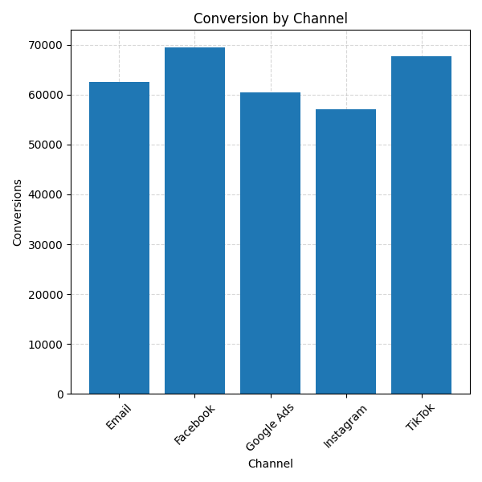
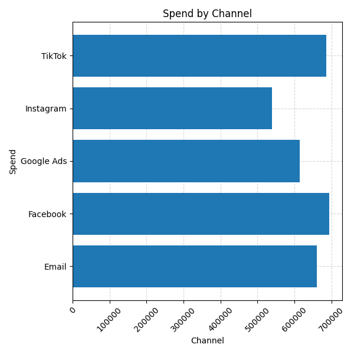
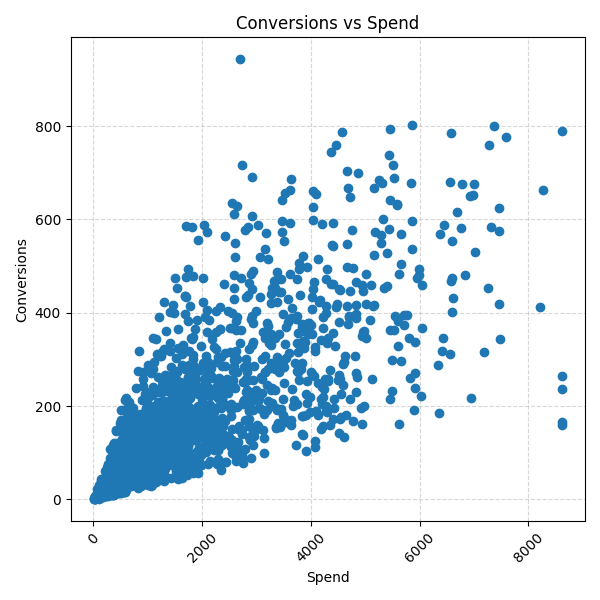
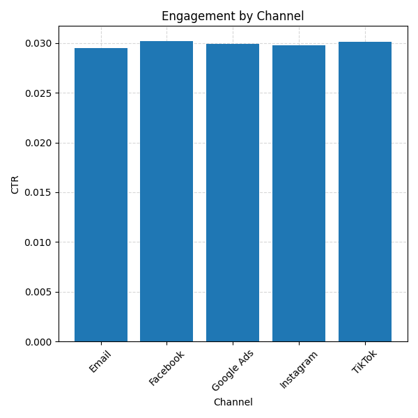
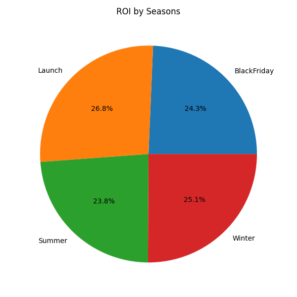
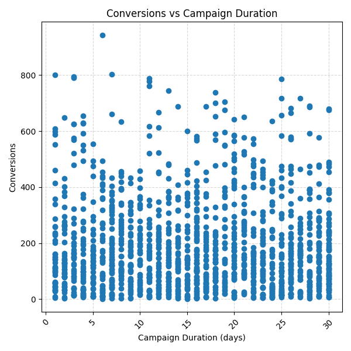
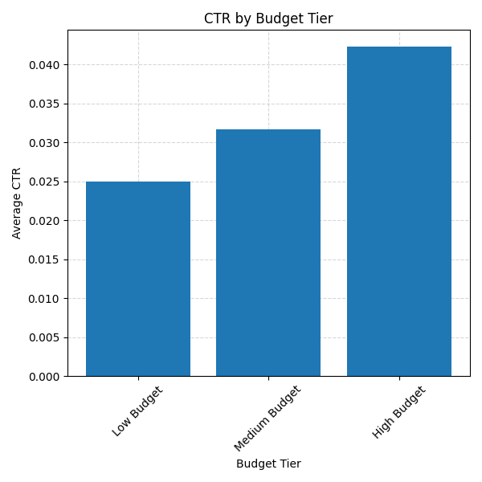

# 📢 Marketing Campaign Analytics Project

An end-to-end Data Analytics project built using Python to simulate a real-world marketing campaign analysis workflow.

This project focuses on:

- Cleaning and validating messy campaign data
- Handling inconsistent formats and business-rule violations
- Feature engineering and campaign categorization
- Marketing performance analysis
- Customer engagement analysis
- Budget efficiency evaluation
- Generating actionable business insights through visualizations

The project was intentionally built using a relatively small but highly inconsistent dataset for learning purposes. The focus was not on dataset size, but on learning realistic data cleaning, validation, and analytical thinking.

---

# 📌 Project Workflow

Raw Marketing Dataset  
↓  
Data Cleaning & Validation  
↓  
Feature Engineering  
↓  
Exploratory Data Analysis (EDA)  
↓  
Marketing Performance Analysis  
↓  
Business Insights & Visualizations  

---

# 📂 Project Structure

```text
marketing-campaign-analytics/
│
├── data/
│   ├── marketing_campaign_data_messy.csv
│   └── marketing_campaign_data_cleaned.csv
│
├── images/
│   ├── conversion_by_channel.png
│   ├── spend_by_channel.png
│   ├── conversions_vs_spend.png
│   ├── engagement_by_channel.png
│   ├── roi_by_seasons.png
│   ├── conversions_vs_campaign_duration.png
│   ├── ctr_by_budget_tier.png
│   ├── conversions_by_budget_tier.png
│   └── roi_by_budget_tier.png
│
├── cleaning.py
├── analysis.py
├── requirements.txt
└── README.md
```

---

# 🏗️ Phase 1 — Data Cleaning & Validation

The first phase focused on transforming messy marketing campaign data into a clean and analysis-ready dataset.

---

## ✅ Header Standardization

Column names were cleaned and standardized using:

```python
str.strip().str.lower().str.replace(" ", "_")
```

This ensures consistent naming across the entire project.

---

## ✅ Duplicate Removal

Duplicate campaigns were removed using:

```python
drop_duplicates(subset=['campaign_id'])
```

This guarantees that each campaign appears only once.

---

## ✅ Spend Cleaning

The spend column contained currency symbols and inconsistent formatting.

Examples:

```text
$1,500
$2,000
1,250 USD
```

Cleaning steps:

- Removed currency symbols
- Removed special characters
- Converted values to numeric format

---

## ✅ Channel Standardization

Marketing channels contained inconsistent spellings such as:

```text
Facebok
Insta_gram
Tik_Tok
Gogle
```

These values were standardized into:

```text
Facebook
Instagram
TikTok
Google Ads
Email
```

Missing channels were intentionally preserved and flagged instead of being artificially imputed.

```python
channel_flag
```

### Why?

A missing marketing channel contains uncertainty. Creating fake categories could distort campaign analysis.

---

## ✅ Boolean Standardization

Campaign activity status contained multiple representations:

```text
Y
Yes
1
True
No
0
False
```

All values were standardized into:

```python
True
False
```

---

## ✅ Date Cleaning & Validation

Campaign start and end dates were converted into proper datetime format.

The project also performed business-rule validation:

```text
end_date < start_date
```

This is logically impossible.

### Assumption Used

If an invalid date range existed:

```python
end_date = start_date + 30 days
```

This assumption was documented and applied consistently.

---

## ✅ Logical Integrity Checks

### Clicks vs Impressions

Validated that:

```text
Clicks ≤ Impressions
```

because a user cannot click an ad that was never shown.

---

## ✅ Outlier Treatment

Spend contained extreme outliers.

Instead of removing campaigns, outliers were capped using:

```python
Upper Bound = Q3 + (3 × IQR)
```

This approach reduces distortion while preserving campaign records.

### Important Note

No outlier flag was retained.

Therefore, individual outlier campaigns cannot be investigated after cleaning.

---

## ✅ Feature Engineering

A new column was extracted from campaign names:

```python
season
```

Using regex parsing:

```python
Q1_Summer_Sale
```

↓

```text
Summer
```

This enabled seasonal campaign analysis later in the project.

---

# 📊 Phase 2 — Marketing Campaign Analysis

The second phase focused on answering realistic marketing business questions.

---

# 📈 Marketing Performance Analysis

## 1. Which Channel Generated the Highest Conversions?

Channels were compared based on total conversions.

### Visualization

Bar Chart



### Business Value

Helps identify the strongest acquisition channel.

---

## 2. Which Channel Consumed the Highest Budget?

Marketing spend was aggregated by channel.

### Visualization

Horizontal Bar Chart



### Business Value

Helps understand budget allocation across channels.

---

## 3. Which Campaigns Had Poor ROI?

A simplified ROI metric was created:

```python
ROI = Conversions / Spend
```

Campaigns with low conversion efficiency were identified.

### Visualization

Scatter Plot



### Business Value

Highlights campaigns that consume budget but generate poor results.

---

## 4. Which Channel Has the Highest Engagement?

Click-through rate (CTR) was calculated.

Formula:

CTR = Clicks / Impressions

### Visualization

Bar Chart



### Business Value

Shows which channels attract the most user interaction.

---

## 5. Which Season Performs Best?

Seasonal performance was analyzed using average ROI.

### Visualization

Pie Chart



### Business Value

Helps identify high-performing seasonal campaigns.

---

# 📅 Campaign Duration Analysis

## 6. Do Longer Campaigns Perform Better?

Campaign duration was calculated as:

```python
End Date - Start Date
```

Correlation between duration and conversions was analyzed.

### Visualization

Scatter Plot



### Business Value

Determines whether longer campaigns contribute to better performance.

---

# 🔍 Campaign Quality Analysis

## 7. Active vs Inactive Campaign Performance

Compared:

- Average Conversions
- Average Spend
- Average CTR

### Business Value

Helps evaluate whether active campaigns are actually outperforming inactive ones.

---

## 8. Missing Channel Investigation

Rows with missing marketing channels were analyzed separately.

Questions answered:

- Do missing-channel campaigns spend more?
- Do they convert better?
- Do they have better ROI?

### Business Value

Demonstrates that missing data itself can contain useful information.

---

# 🎯 Conversion Efficiency Analysis

## 9. Conversion Rate Analysis

Formula:

```python
Conversion Rate = Conversions / Clicks
```

Questions answered:

- Which channel converts best?
- Which campaigns waste clicks?

### Business Value

Identifies efficient and inefficient campaign strategies.

---

# 💰 Budget Efficiency Analysis

## 10. Budget Tier Performance

Campaigns were grouped into:

- Low Budget
- Medium Budget
- High Budget

Metrics compared:

- CTR
- Conversions
- ROI

### Visualizations

#### CTR by Budget Tier



#### ROI by Seasons


#### Spend by Channel


#### Conversion vs Spend


### Business Value

Helps determine whether larger budgets actually produce better outcomes.

---

# 📊 Key Concepts Demonstrated

## Data Cleaning

- Data Standardization
- Missing Value Handling
- Duplicate Removal
- Currency Cleaning
- Boolean Mapping
- Datetime Processing

## Data Validation

- Logical Integrity Checks
- Business Rule Validation
- Outlier Treatment
- Data Quality Auditing

## Data Analysis

- Exploratory Data Analysis (EDA)
- Marketing Analytics
- Campaign Performance Analysis
- Customer Engagement Analysis
- Budget Efficiency Analysis

## Visualization

- Bar Charts
- Horizontal Bar Charts
- Pie Charts
- Scatter Plots

---

# 🛠️ Technologies Used

- Python
- Pandas
- NumPy
- Matplotlib

---

# 🚀 Key Learnings

This project helped build understanding of:

- Real-world messy marketing data
- Business-rule validation
- Why missing values should not always be forcefully filled
- Campaign performance measurement
- Marketing KPIs such as CTR and Conversion Rate
- Budget allocation analysis
- Turning raw campaign data into business insights

One of the most important lessons learned was:

> Data cleaning is not just fixing formats. It is about preserving data integrity while making the dataset trustworthy for analysis.

---

# 👩‍💻 Author

Simran

This project was built as a hands-on learning project to practice realistic marketing campaign analytics, data cleaning, validation, and business-oriented exploratory data analysis using Python.
